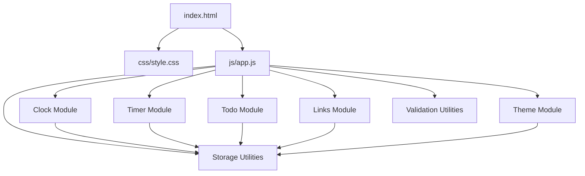
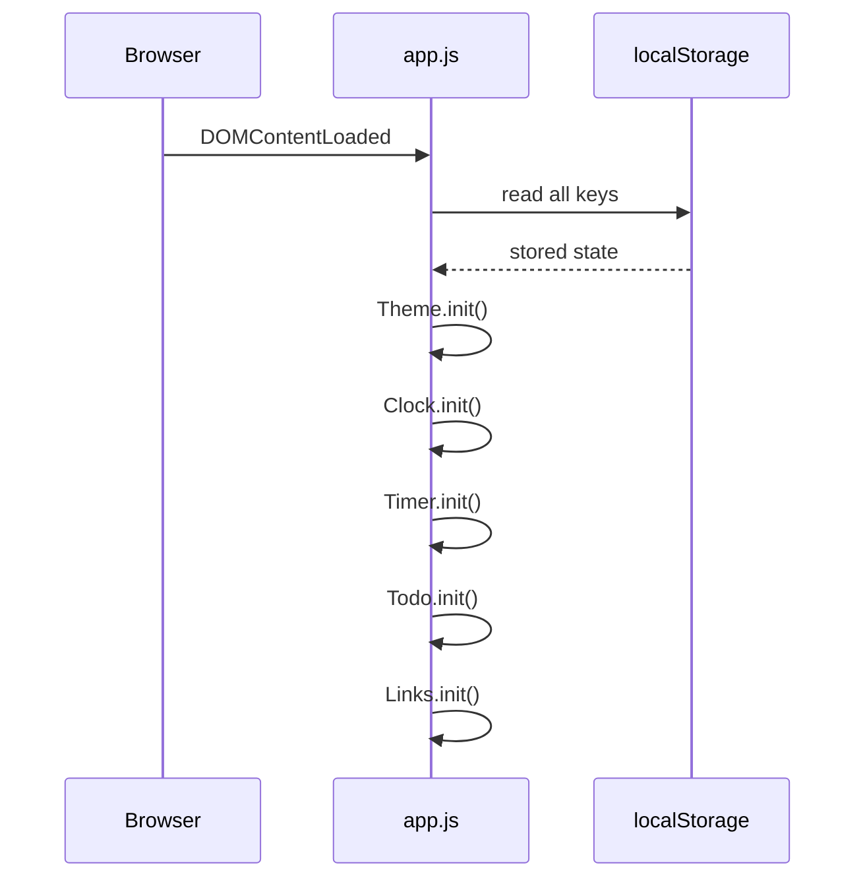
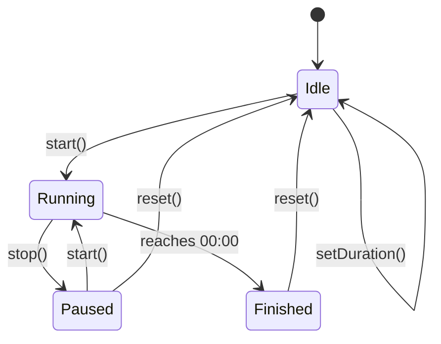

# Design Document

## Overview

The personal dashboard is a single-page web application that runs entirely in the browser. It is built with pure HTML, CSS, and Vanilla JavaScript — no frameworks, no build tools, no backend. All state is persisted via the browser's `localStorage` API.

The app is composed of five functional widgets:

1. **Greeting / Clock** — live time, date, and a time-aware personalized greeting
2. **Focus Timer** — configurable Pomodoro-style countdown with start/stop/reset
3. **To-Do List** — task management with add, edit, complete, delete, and duplicate prevention
4. **Quick Links** — saved URL shortcuts that open in a new tab
5. **Theme Toggle** — light/dark mode switch persisted across sessions

The entire application ships as three files:

```
index.html
css/style.css
js/app.js
```

No external dependencies, CDN links, or server are required. Opening `index.html` in any modern browser is sufficient to run the app.

---

## Architecture

The app follows a simple **module-per-widget** pattern inside a single `app.js` file. Each widget owns its own state, DOM references, and localStorage key. A thin shared utility layer handles localStorage reads/writes and common DOM helpers.



### Initialization Flow



Each module's `init()` function reads its persisted state from localStorage, renders the initial UI, and attaches event listeners.

---

## Components and Interfaces

### Clock Module

Responsible for the live clock, date display, and greeting.

**Public interface:**
```js
Clock.init()          // reads stored name, starts setInterval tick
Clock.setName(name)   // updates stored name and re-renders greeting
```

**Behavior:**
- `setInterval` fires every 1 000 ms and updates the time display
- Greeting phrase is derived from `new Date().getHours()` at each tick
- Name is read from `localStorage` on init; updated via the name input form

---

### Timer Module

Manages the Pomodoro countdown.

**Public interface:**
```js
Timer.init()              // reads stored duration, renders initial state
Timer.start()             // begins countdown interval
Timer.stop()              // clears interval, preserves remaining time
Timer.reset()             // clears interval, restores to configured duration
Timer.setDuration(mins)   // validates, stores, and applies new duration
```

**State machine:**



**Notification:** When the timer reaches 00:00 the module plays a short beep via the Web Audio API (`AudioContext`) and adds a CSS class to flash the display.

---

### Todo Module

Manages the task list.

**Public interface:**
```js
Todo.init()                    // loads tasks from localStorage, renders list
Todo.addTask(text)             // validates, deduplicates, appends task
Todo.editTask(id, newText)     // validates, deduplicates, updates task
Todo.toggleComplete(id)        // flips completed flag
Todo.deleteTask(id)            // removes task by id
```

**Task identity:** Each task is assigned a unique `id` using `crypto.randomUUID()` (or a `Date.now()` fallback for older browsers). Duplicate detection compares `.trim().toLowerCase()` of the new text against all existing task texts.

---

### Links Module

Manages the quick links panel.

**Public interface:**
```js
Links.init()                   // loads links from localStorage, renders panel
Links.addLink(label, url)      // validates, appends link
Links.deleteLink(id)           // removes link by id
```

**URL validation:** Uses the `URL` constructor (`new URL(value)`) to validate URLs. Only `http:` and `https:` schemes are accepted.

---

### Theme Module

Manages light/dark mode.

**Public interface:**
```js
Theme.init()     // reads stored preference, applies theme class to <html>
Theme.toggle()   // flips theme, persists new value
```

**Implementation:** A `data-theme` attribute is set on the `<html>` element (`data-theme="light"` or `data-theme="dark"`). All color tokens are defined as CSS custom properties scoped to `[data-theme]` selectors.

---

### Validation Utilities

Shared pure functions used by multiple modules.

```js
isNonEmptyString(value)          // returns true if trimmed length > 0
isValidUrl(value)                // returns true if URL constructor succeeds and scheme is http/https
isInRange(value, min, max)       // returns true if integer value is within [min, max]
isDuplicateTask(text, tasks)     // returns true if any task matches text case-insensitively
isDuplicateLink(label, links)    // returns true if any link matches label case-insensitively
```

---

### Storage Utilities

Thin wrappers around `localStorage`.

```js
Storage.get(key, fallback)   // JSON.parse with fallback on missing/invalid data
Storage.set(key, value)      // JSON.stringify and store
```

---

## Data Models

All data is stored as JSON strings in `localStorage`.

### Keys

| Key | Type | Description |
|-----|------|-------------|
| `pd_name` | `string` | User's display name |
| `pd_timer_duration` | `number` | Session length in minutes (1–120) |
| `pd_tasks` | `Task[]` | Array of task objects |
| `pd_links` | `Link[]` | Array of link objects |
| `pd_theme` | `"light" \| "dark"` | Active theme |

### Task

```js
{
  id: string,          // crypto.randomUUID() or Date.now().toString()
  text: string,        // task description (trimmed)
  completed: boolean   // completion state
}
```

### Link

```js
{
  id: string,    // crypto.randomUUID() or Date.now().toString()
  label: string, // display label (trimmed)
  url: string    // validated http/https URL
}
```

---

## Correctness Properties

*A property is a characteristic or behavior that should hold true across all valid executions of a system — essentially, a formal statement about what the system should do. Properties serve as the bridge between human-readable specifications and machine-verifiable correctness guarantees.*

### Property 1: Time format correctness

*For any* `Date` object, the time-formatting function SHALL return a string matching the pattern `HH:MM` where HH is a zero-padded hour (00–23) and MM is a zero-padded minute (00–59).

**Validates: Requirements 1.1**

---

### Property 2: Date format correctness

*For any* `Date` object, the date-formatting function SHALL return a string that contains a full weekday name, a numeric day, a full month name, and a four-digit year.

**Validates: Requirements 1.2**

---

### Property 3: Greeting phrase by hour

*For any* integer hour in [0, 23], the greeting function SHALL return exactly one of "Good morning" (hours 5–11), "Good afternoon" (hours 12–17), "Good evening" (hours 18–21), or "Good night" (hours 22–23 and 0–4), with no hour mapping to more than one phrase and no hour left unmapped.

**Validates: Requirements 1.3, 1.4, 1.5, 1.6**

---

### Property 4: Name appears in greeting

*For any* non-empty name string, after calling `Clock.setName(name)`, the rendered greeting text SHALL contain the name.

**Validates: Requirements 2.2**

---

### Property 5: Name persistence round-trip

*For any* name string, calling `Clock.setName(name)` SHALL write the name to localStorage such that re-initializing the Clock module produces a greeting containing that same name.

**Validates: Requirements 2.3, 2.4**

---

### Property 6: Timer display format

*For any* integer number of remaining seconds in [0, 7200], the timer-formatting function SHALL return a string matching the pattern `MM:SS` where MM is zero-padded minutes and SS is zero-padded seconds.

**Validates: Requirements 3.6**

---

### Property 7: Timer reset restores configured duration

*For any* valid configured duration d (in minutes), after starting the timer and advancing time, calling `Timer.reset()` SHALL restore the display to `d:00` and stop the countdown.

**Validates: Requirements 3.4**

---

### Property 8: Valid duration updates timer display

*For any* integer duration d in [1, 120], calling `Timer.setDuration(d)` while the timer is not running SHALL update the timer display to show `d:00`.

**Validates: Requirements 4.2**

---

### Property 9: Duration persistence round-trip

*For any* valid duration d in [1, 120], calling `Timer.setDuration(d)` SHALL write d to localStorage such that re-initializing the Timer module applies d as the session length.

**Validates: Requirements 4.3, 4.4**

---

### Property 10: Invalid duration is rejected

*For any* integer d outside [1, 120] (i.e., d < 1 or d > 120), calling `Timer.setDuration(d)` SHALL display a validation error and leave the previously configured duration unchanged.

**Validates: Requirements 4.5**

---

### Property 11: Task addition grows the list

*For any* non-empty, non-duplicate task text, calling `Todo.addTask(text)` SHALL increase the task list length by exactly one and the new task SHALL appear in the rendered list.

**Validates: Requirements 5.2**

---

### Property 12: Task edit persistence round-trip

*For any* existing task and any valid new text (non-empty, non-duplicate), calling `Todo.editTask(id, newText)` SHALL update the task text in localStorage such that re-initializing the Todo module displays the updated text.

**Validates: Requirements 5.4**

---

### Property 13: Complete toggle is a round-trip

*For any* task, calling `Todo.toggleComplete(id)` twice SHALL return the task to its original `completed` state (idempotent pair).

**Validates: Requirements 5.5**

---

### Property 14: Task deletion removes the task

*For any* task list containing at least one task, calling `Todo.deleteTask(id)` SHALL remove exactly that task from the list, reducing its length by one, and the deleted task SHALL no longer appear in the rendered list.

**Validates: Requirements 5.6**

---

### Property 15: Task list loads from localStorage

*For any* array of task objects stored in localStorage under `pd_tasks`, initializing the Todo module SHALL render all tasks from that array with correct text and completion state.

**Validates: Requirements 5.8**

---

### Property 16: Duplicate task add is rejected

*For any* existing task text T and any string S such that `S.trim().toLowerCase() === T.trim().toLowerCase()`, calling `Todo.addTask(S)` SHALL reject the submission and leave the task list unchanged.

**Validates: Requirements 6.1**

---

### Property 17: Duplicate task edit is rejected

*For any* two distinct tasks with texts T1 and T2, attempting to edit T1 to any string S where `S.trim().toLowerCase() === T2.trim().toLowerCase()` SHALL reject the edit and leave both tasks unchanged.

**Validates: Requirements 6.3**

---

### Property 18: Valid link renders with correct href and target

*For any* valid label string and valid http/https URL, calling `Links.addLink(label, url)` SHALL render an anchor element with `href` equal to the URL and `target="_blank"`.

**Validates: Requirements 7.2**

---

### Property 19: Link deletion removes the link

*For any* link list containing at least one link, calling `Links.deleteLink(id)` SHALL remove exactly that link from the list and it SHALL no longer appear in the rendered panel.

**Validates: Requirements 7.3**

---

### Property 20: Link list loads from localStorage

*For any* array of link objects stored in localStorage under `pd_links`, initializing the Links module SHALL render all links from that array with correct labels and URLs.

**Validates: Requirements 7.5**

---

### Property 21: Invalid link submission is rejected

*For any* submission where the label is empty (after trimming) or the URL fails `new URL()` validation or uses a non-http/https scheme, calling `Links.addLink(label, url)` SHALL reject the submission and leave the link list unchanged.

**Validates: Requirements 7.6**

---

### Property 22: Theme persistence round-trip

*For any* theme value (`"light"` or `"dark"`), after `Theme.toggle()` sets that theme, the value SHALL be written to localStorage such that re-initializing the Theme module applies the same `data-theme` attribute to the `<html>` element.

**Validates: Requirements 8.3, 8.4**

---

## Error Handling

### Validation Errors

All validation errors are displayed inline, adjacent to the relevant input field. No modal dialogs or page-level alerts are used.

| Scenario | Error Location | Message |
|----------|---------------|---------|
| Empty task text | Below task input | "Task cannot be empty." |
| Duplicate task (add) | Below task input | "A task with this name already exists." |
| Duplicate task (edit) | Below edit input | "A task with this name already exists." |
| Empty link label | Below label input | "Label cannot be empty." |
| Invalid/empty URL | Below URL input | "Please enter a valid URL (http or https)." |
| Timer duration out of range | Below duration input | "Duration must be between 1 and 120 minutes." |

Error messages are cleared when the user modifies the relevant input field.

### localStorage Errors

- `Storage.get()` wraps `JSON.parse` in a try/catch. On parse failure it returns the provided fallback value, preventing a corrupted entry from crashing the app.
- `Storage.set()` wraps `localStorage.setItem` in a try/catch. On `QuotaExceededError` (storage full) it logs a console warning; the in-memory state remains valid.

### Timer Audio

The Web Audio API `AudioContext` is created lazily on first user interaction (required by browser autoplay policies). If `AudioContext` is unavailable (e.g., very old browser), the audio notification is silently skipped; the visual flash notification still fires.

### Missing DOM Elements

Each module's `init()` function checks that required DOM elements exist before attaching event listeners. If an element is missing (e.g., partial HTML), the module logs a console error and exits gracefully without throwing.

---

## Testing Strategy

### Overview

The testing approach uses two complementary layers:

1. **Unit / example-based tests** — verify specific behaviors, edge cases, and error conditions with concrete inputs
2. **Property-based tests** — verify universal properties across hundreds of randomly generated inputs

The property-based testing library used is **[fast-check](https://github.com/dubzzz/fast-check)** (JavaScript). Each property test runs a minimum of **100 iterations**.

### Test File Structure

```
tests/
  unit/
    clock.test.js
    timer.test.js
    todo.test.js
    links.test.js
    theme.test.js
    validation.test.js
    storage.test.js
  property/
    clock.property.test.js
    timer.property.test.js
    todo.property.test.js
    links.property.test.js
    theme.property.test.js
```

### Property Test Tag Format

Each property test is tagged with a comment referencing the design property:

```js
// Feature: personal-dashboard, Property 3: Greeting phrase by hour
fc.assert(fc.property(fc.integer({ min: 0, max: 23 }), (hour) => {
  // ...
}), { numRuns: 100 });
```

### Property Tests (fast-check)

| Property | Module | fast-check Arbitraries |
|----------|--------|----------------------|
| 1: Time format | Clock | `fc.date()` |
| 2: Date format | Clock | `fc.date()` |
| 3: Greeting by hour | Clock | `fc.integer({ min: 0, max: 23 })` |
| 4: Name in greeting | Clock | `fc.string({ minLength: 1 })` |
| 5: Name round-trip | Clock | `fc.string()` |
| 6: Timer display format | Timer | `fc.integer({ min: 0, max: 7200 })` |
| 7: Reset restores duration | Timer | `fc.integer({ min: 1, max: 120 })` |
| 8: Valid duration updates display | Timer | `fc.integer({ min: 1, max: 120 })` |
| 9: Duration round-trip | Timer | `fc.integer({ min: 1, max: 120 })` |
| 10: Invalid duration rejected | Timer | `fc.oneof(fc.integer({ max: 0 }), fc.integer({ min: 121 }))` |
| 11: Task add grows list | Todo | `fc.string({ minLength: 1 })` |
| 12: Task edit round-trip | Todo | `fc.string({ minLength: 1 })`, `fc.string({ minLength: 1 })` |
| 13: Complete toggle round-trip | Todo | `fc.array(fc.record({ text: fc.string({ minLength: 1 }) }))` |
| 14: Task delete removes task | Todo | `fc.array(fc.record({ text: fc.string({ minLength: 1 }) }), { minLength: 1 })` |
| 15: Task list load | Todo | `fc.array(fc.record({ id: fc.uuid(), text: fc.string({ minLength: 1 }), completed: fc.boolean() }))` |
| 16: Duplicate add rejected | Todo | `fc.string({ minLength: 1 })`, case-variant generator |
| 17: Duplicate edit rejected | Todo | two distinct `fc.string({ minLength: 1 })` values |
| 18: Link renders correctly | Links | `fc.string({ minLength: 1 })`, `fc.webUrl()` |
| 19: Link delete removes link | Links | `fc.array(fc.record(...), { minLength: 1 })` |
| 20: Link list load | Links | `fc.array(fc.record({ id: fc.uuid(), label: fc.string({ minLength: 1 }), url: fc.webUrl() }))` |
| 21: Invalid link rejected | Links | `fc.constant("")`, `fc.string()` filtered to invalid URLs |
| 22: Theme round-trip | Theme | `fc.constantFrom("light", "dark")` |

### Unit / Example Tests

- **Clock**: default greeting (no name), time display updates on tick (fake timers)
- **Timer**: default 25-minute load, start/stop state transitions, finish notification, audio fallback
- **Todo**: edit UI appears on click, error message shown on duplicate add/edit
- **Links**: error message shown on invalid submission
- **Theme**: toggle changes `data-theme` attribute, default light theme on empty localStorage
- **Storage**: `get()` returns fallback on corrupted JSON, `set()` handles `QuotaExceededError`

### Test Environment

Tests run in **jsdom** (via Jest or Vitest) to simulate the browser DOM and `localStorage`. The Web Audio API is mocked. `setInterval`/`setTimeout` use fake timers (`jest.useFakeTimers()` or Vitest equivalent).
